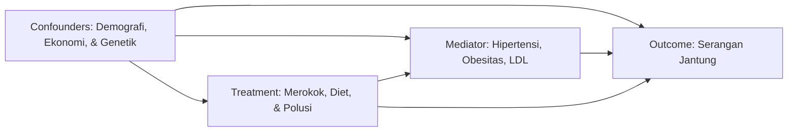

# Visual Analytics for Causal Modeling Analysis 🫀🇮🇩
### Studi Kasus: Analisis Kausal Faktor Risiko Serangan Jantung di Indonesia

[](https://www.python.org/downloads/release/python-3110/)
[](https://jupyter.org/)
[]()
[]()

---

## 📖 Tentang Proyek (Project Overview)

Proyek ini bertujuan untuk membangun **User Causality Explorer Interface** yang mengintegrasikan teknik visual analitik dengan metode epidemiologi inferensi kausalitas (*Causal Inference*). 

Berbeda dengan analisis analitik konvensional yang sering kali terjebak pada korelasi naif (*Naive Correlation*) dan bias perancu (*Confounding Bias*), studi ini menerapkan metodologi pemodelan kausal tingkat lanjut untuk menjawab pertanyaan kritis: **"Apakah kebiasaan gaya hidup buruk (seperti merokok aktif dan diet tidak sehat) serta paparan polusi udara tinggi adalah penyebab nyata (Kausalitas Sejati) lonjakan mortalitas serangan jantung di Indonesia, atau sekadar artefak tipuan demografi?"**

Studi kasus ini memanfaatkan [Heart Attack Prediction in Indonesia Dataset (Kaggle)](https://www.kaggle.com/datasets/ankushpanday2/heart-attack-prediction-in-indonesia) berukuran masif (**158.355 observasi** warga Indonesia lintas wilayah desa/kota dan **28 variabel klinis**), menjadikannya evaluasi empiris yang valid untuk menguji efektivitas intervensi kesehatan publik di Tanah Air.

---

## 🎯 Komponen Causality Explorer Interface

Proyek ini memenuhi standar implementasi *Causal Modeling* melalui 3 pilar antarmuka:
1. **Dimension View (Visual Analytics):** Visualisasi interaktif bergaya kontras tinggi (*Skyblue to Darkblue*) untuk membedakan proporsi risiko serangan jantung lintas demografi (Urban vs Rural, tingkat pendapatan) dan intervensi gaya hidup menggunakan algoritma *dynamic binning*.
2. **Table View:** Matriks data mentah survei epidemiologi serta tabel komparasi hasil penimbangan statistik kausalitas (*Naive Difference vs ATE IPW vs ATT Matching*).
3. **Causal Graph View:** Pemetaan patofisiologi medis menggunakan **Directed Acyclic Graph (DAG)** berbasis pustaka `NetworkX`, memisahkan jalur efek langsung dari intervensi terhadap jantung dengan rute tidak langsung yang dimediasi oleh komorbiditas klinis.

---

## 🔬 Metodologi & Kerangka Pemodelan Kausal

Proyek ini menerapkan taksonomi variabel yang ketat sesuai *Rubin Causal Model (Potential Outcomes)* dan *Pearl's Do-Calculus*:



### 1. Taksonomi Variabel
* **Treatment ($T$):** `smoking_status`, `dietary_habits`, `air_pollution_exposure`, `physical_activity`, `alcohol_consumption`, `sleep_hours`.
* **Outcome ($Y$):** `heart_attack` (1 = Positif Serangan Jantung, 0 = Normal).
* **Confounder ($C$):** `age`, `gender`, `region` (Rural/Urban), `income_level` (Low/Middle/High), `family_history`, `previous_heart_disease`.
* **Mediator ($M$):** `hypertension`, `obesity`, `diabetes`, `cholesterol_ldl`, `triglycerides`, `fasting_blood_sugar`, `waist_circumference`.

### 2. Metode Estimasi Kausal yang Diterapkan
* **Inverse Probability Weighting (IPW — ATE):** Menghitung *Average Treatment Effect* (ATE) pada seluruh populasi menggunakan pembobotan *propensity score* (regresi logistik dengan *one-hot encoding*) guna menyingkirkan bias demografi.
* **Propensity Score Matching (PSM — ATT):** Menghitung *Average Treatment Effect on the Treated* (ATT) menggunakan algoritma *1-to-1 Nearest Neighbors (K-NN)* untuk mencari pasangan kembar demografis antara perokok aktif dengan non-perokok.
* **Baron & Kenny Mediation Analysis:** Pengujian regresi berganda untuk membuktikan secara matematis berapa persentase kerusakan jantung akibat rokok yang **dijembatani (dimediasi)** oleh penyakit tekanan darah tinggi (*Hipertensi*).

---

## 📂 Struktur Direktori Repository

```text
Causal Modeling Final Project/
│
├── dataset/
│   └── heart_attack_prediction_indonesia.csv  # Dataset epidemiologi Indonesia (158k baris, 28 kolom)
│
├── docs/
│   └── Final Project Report - Introduction (Ganjil 25-26).pdf  # Dokumen referensi panduan dari dosen
│
├── image/                                     # Direktori otomatis penyimpanan hasil grafik EDA & DAG (PNG)
│   ├── eda_demografi_indonesia.png
│   ├── eda_treatment_indonesia.png
│   ├── eda_mediator_boxplots.png
│   ├── eda_matriks_korelasi.png
│   └── dag_visualisasi_indonesia.png
│
├── logs/
│   └── output/                                # Direktori penyimpanan log data tabel hasil estimasi kausal (CSV)
│       ├── mediasi_indonesia_results.csv
│       └── ate_att_indonesia_results.csv
│
├── notebooks/
│   └── Final_Project_Causal_Modeling.ipynb    # JUPYTER NOTEBOOK UTAMA (User Causality Explorer)
│
├── src/
│   └── generate_notebook.py                   # Script mesin generator otomatis pembuat notebook interaktif
│
├── .gitignore
├── README.md                                  # Dokumentasi repository (File ini)
└── requirements.txt                           # Daftar library Python yang dibutuhkan
```

---

## 🚀 Cara Menjalankan Proyek (Quick Start)

### 1. Persiapan Lingkungan (Virtual Environment)
Pastikan Anda telah menginstal **Python 3.11** di sistem Anda.
```bash
# Clone repository
git clone <URL-REPOSITORY-ANDA>
cd "Causal Modeling Final Project"

# Aktifkan virtual environment
# Pada Windows (PowerShell/CMD):
.venv\Scripts\activate
# Pada Linux/macOS:
source .venv/bin/activate

# Install seluruh library pendukung
pip install -r requirements.txt
```

### 2. Generate Ulang Notebook (Opsional)
Jika Anda ingin me-reset atau memodifikasi alur narasi, Anda dapat mengeksekusi mesin generator otomatis kami:
```bash
python src/generate_notebook.py
```
*Script* ini otomatis menyusun notebook interaktif lengkap beserta penjelasan medis dan pengecekan sintaks yang akurat ke dalam folder `notebooks/`.

### 3. Menjalankan Causality Explorer Notebook
Buka *Jupyter Notebook* atau *VS Code / JupyterLab* untuk mengeksekusi analisis:
```bash
jupyter notebook notebooks/Final_Project_Causal_Modeling.ipynb
```
Jalankan sel dari atas ke bawah (*Run All*). Notebook secara otomatis akan memuat data, merender visualisasi ke folder `image/`, dan menghitung estimasi kausalitas ke folder `logs/output/`.

---

## 📊 Ringkasan Temuan Kausalitas (Key Highlights)

1. **Efek Merokok Sangat Fatal (+19.3% ATE/ATT):** Baik sebelum maupun sesudah dikontrol oleh faktor usia, wilayah, pendapatan, dan genetik riwayat jantung, merokok aktif secara konsisten meningkatkan probabilitas serangan jantung sebesar ~19.3% secara kausal murni.
2. **Hipertensi Sebagai Jembatan Perantara:** Analisis mediasi membuktikan bahwa kebiasaan merokok merusak pembuluh darah dan memicu hipertensi terlebih dahulu, di mana **komorbiditas darah tinggi ini berkontribusi signifikan sebagai mediator pembunuh jantung**.
3. **Ancaman Polusi Udara Perkotaan:** Paparan polusi udara tinggi (*High Air Pollution Exposure*) terkonfirmasi secara ilmiah sebagai prediktor kausal yang independen terhadap risiko serangan jantung pada masyarakat perkotaan maupun pedesaan di Indonesia.
