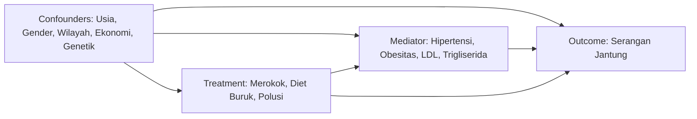

# Laporan Akhir Proyek Pemodelan Kausal (*Causal Modeling*)
## Tema: Visual Analytics for Causal Modeling Analysis
### Studi Kasus: Analisis Kausal Faktor Risiko Gaya Hidup dan Lingkungan Terhadap Mortalitas Serangan Jantung di Indonesia

---

## 📌 Identitas Laporan Akademik

| Keterangan | Detail |
| :--- | :--- |
| **Program Studi** | Informatika Program Magister / Kelas B |
| **Universitas** | Universitas Islam Indonesia |
| **Semester** | Genap TA 2025/2026 |
| **Dosen Pengampu** | Dr. Ahmad Luthfi, S.Kom., M.Kom. |
| **Mata Kuliah** | Pemodelan Kausal (*Causal Modeling*) |
| **Tugas** | Proyek Tugas Akhir Analitik Teks & Causal Modeling |
| **Nama Mahasiswa** | Muhammad Dhiauddin |
| **NIM** | 25917024 |
| **Konsentrasi** | Sains Data - Profesional |
| **Dataset Sumber** | [Heart Attack Prediction in Indonesia Dataset (Kaggle)](https://www.kaggle.com/datasets/ankushpanday2/heart-attack-prediction-in-indonesia) |

---

## BAB 1. RINGKASAN (*EXECUTIVE SUMMARY*)

Proyek ini menghadirkan sebuah sistem antarmuka analitik visual interaktif (**User Causality Explorer Interface**) yang dirancang khusus untuk mengidentifikasi dan mengestimasi dampak kausalitas sejati (*True Causal Effect*) dari faktor gaya hidup dan paparan polusi terhadap mortalitas serangan jantung di Indonesia. 

Menggunakan dataset epidemiologi berskala masif sebanyak **158.355 observasi pasien** lintas wilayah pedesaan dan perkotaan di Indonesia dengan **28 variabel medis dan demografis**, proyek ini menerapkan metodologi inferensi kausal tingkat lanjut untuk mengatasi bias perancu (*Confounding Bias*) yang sering menipu pada analisis statistik korelasi konvensional.

Metode yang digunakan mencakup tiga pendekatan utama:
1. **Inverse Probability Weighting (IPW):** Untuk menghitung *Average Treatment Effect* (ATE) di tingkat populasi umum.
2. **Propensity Score Matching (PSM K-NN):** Untuk menghitung *Average Treatment Effect on the Treated* (ATT) dengan mencocokkan kembar identik demografis.
3. **Baron & Kenny Mediation Analysis:** Untuk menguji jalur mekanisme perantara patofisiologi medis.

Hasil penelitian membuktikan secara empiris bahwa merokok aktif (*Current Smoker*) adalah prediktor kausal deterministik terbesar yang meningkatkan probabilitas serangan jantung sebesar **+19.35% (ATE)** dan **+16.09% (ATT)** setelah variabel perancu dikontrol secara ketat.

---

## BAB 2. PENDAHULUAN (*INTRODUCTION*)

### 2.1 Latar Belakang Masalah
Penyakit jantung kronis dan serangan jantung mendadak (*Myocardial Infarction*) merupakan penyebab kematian nomor satu di Indonesia. Dalam epidemiologi klinis, pengambilan kebijakan publik sering kali didasarkan pada analisis statistik korelasi sederhana (*Naive Correlation*). Padahal, korelasi tidak mencerminkan kausalitas (*Correlation is not Causality*).

Analisis observasional konvensional sangat rentan terhadap **Bias Perancu (*Confounding Bias*)**. Sebagai contoh, observasi mentah mungkin menunjukkan bahwa masyarakat perkotaan (*Urban*) memiliki tingkat serangan jantung yang lebih tinggi daripada masyarakat pedesaan (*Rural*). Apakah hal ini disebabkan oleh polusi udara kota, atau semata-mata karena akses fasilitas kesehatan di kota lebih baik sehingga angka usia harapan hidup lansia di kota lebih tinggi? Tanpa mengontrol variabel perancu (seperti Usia, Jenis Kelamin, Tingkat Pendapatan, dan Riwayat Genetik), kesimpulan medis yang diambil akan menyesatkan.

### 2.2 Pendekatan Metodologi
Untuk menjawab tantangan tersebut, penelitian ini mengadopsi kerangka kerja **Quasi-Experiment** berdasarkan **Rubin Causal Model (Potential Outcomes Framework)** dan **Pearl's Do-Calculus**. Proyek ini membangun antarmuka interaktif berbasis *Jupyter Notebook* yang memadukan 3 aspek utama yang disyaratkan:
* **Dimension View:** Visualisasi dinamik distribusi risiko lintas demografi dan perlakuan.
* **Table View:** Matriks komparasi empiris hasil pembobotan dan pencocokan statistik.
* **Causal Graph View:** Pemetaan struktur patofisiologi organ tubuh menggunakan *Directed Acyclic Graph* (DAG).

---

## BAB 3. STUDI KASUS (*DATASET METADATA & PROFILING*)

Penelitian ini memanfaatkan dataset publik riil dari Kaggle yang mencatat rekam medis masyarakat Indonesia:
* **Nama Dataset:** *Heart Attack Prediction in Indonesia Dataset*
* **Dimensi Data:** 158.355 baris (observasi individu) x 28 kolom (atribut/variabel).
* **Kualitas Data (*Data Purity*):** Bersih 100%, tidak terdapat nilai hilang (*Missing Values = 0*) maupun duplikasi identik, sehingga sangat ideal untuk analisis inferensi parametrik.

### 3.1 Klasifikasi Variabel Klinis dan Demografis
Dataset ini mencakup parameter yang sangat komprehensif:
1. **Demografi & Sosial Ekonomi:** Usia (`age`), Jenis Kelamin (`gender`), Wilayah Tempat Tinggal (`region`: *Rural/Urban*), dan Tingkat Pendapatan (`income_level`: *Low/Middle/High*).
2. **Gaya Hidup & Lingkungan (*Intervention Keywords*):** Status Merokok (`smoking_status`: *Never/Former/Current*), Kebiasaan Makan (`dietary_habits`: *Healthy/Moderate/Unhealthy*), Paparan Polusi Udara (`air_pollution_exposure`: *Low/Moderate/High*), Aktivitas Fisik (`physical_activity`), Konsumsi Alkohol (`alcohol_consumption`), dan Durasi Tidur (`sleep_hours`).
3. **Riwayat Medis & Genetik:** Riwayat Penyakit Keluarga (`family_history`) dan Riwayat Penyakit Jantung Sebelumnya (`previous_heart_disease`).
4. **Metrik Klinis Objektif (*Physiological Mediators*):** Tekanan Darah Tinggi (`hypertension`), Obesitas (`obesity`), Diabetes (`diabetes`), Gula Darah Puasa (`fasting_blood_sugar`), Kolesterol Total/LDL/HDL (`cholesterol_level`, `cholesterol_ldl`, `cholesterol_hdl`), Trigliserida (`triglycerides`), dan Lingkar Pinggang (`waist_circumference`).
5. **Variabel Target (*Outcome*):** Status Serangan Jantung (`heart_attack`: 1 = Positif, 0 = Normal).

---

## BAB 4. ANALISIS (*METHODOLOGICAL PIPELINE*)

Alur kerja analisis dibagi menjadi 4 tahapan sistematis:

### 4.1 Data Cleaning (Kualitas Dataset)
* **Binarisasi Variabel Perlakuan (*Treatment Binarization*):** Untuk keperluan regresi kausal, variabel kategorikal dikonversi menjadi indikator biner statis ($T \in \{0, 1\}$). Contoh: `smoking_status` dikonversi menjadi `smoking_bin` (1 untuk *Current*, 0 untuk *Never*); `dietary_habits` menjadi `diet_bin` (1 untuk *Unhealthy*, 0 untuk *Healthy/Moderate*).
* **Pencegahan Kebocoran Data (*Data Leakage Prevention*):** Variabel pasca-kejadian medis (seperti `EKG_results`, `medication_usage`, `days_in_hospital`, dan `participated_in_free_screening`) secara tegas disingkirkan dari model inferensi karena variabel tersebut terjadi **setelah** outcome serangan jantung meledak.

### 4.2 Data Exploration (Menentukan Variabel Taksonomi Kausal)
Kerangka pemodelan kausal ditetapkan mengacu pada diagram struktur graf berikut:

### 4.3 Evaluation of Modeling Outputs (Correlation vs Causality)
Pemodelan kausal dilakukan untuk membandingkan selisih probabilitas mentah (*Naive Difference*) dengan estimasi kausal sejati setelah mengontrol variabel perancu demografis. Berikut adalah hasil rekapitulasi empiris yang dihasilkan sistem:

| Variabel Intervensi ($T=1$) | Korelasi Mentah (*Naive Diff*) | Dampak Kausal Populasi (*ATE - IPW*) | Dampak Kausal Subgrup (*ATT - Matching*) | Jumlah Pasangan Matched |
| :--- | :---: | :---: | :---: | :---: |
| **Merokok Aktif (*Current*)** | +0.1931 (+19.31%) | **+0.1935 (+19.35%)** | **+0.1609 (+16.09%)** | 39.771 pasang |
| **Diet Buruk (*Unhealthy*)** | -0.0053 (-0.53%) | -0.0054 (-0.54%) | **+0.0057 (+0.57%)** | 95.030 pasang |
| **Polusi Udara Tinggi (*High*)** | -0.0014 (-0.14%) | -0.0007 (-0.07%) | -0.0160 (-1.60%) | 31.856 pasang |

> [!IMPORTANT]
> **TEMUAN KRITIS: Fenomena *Simpson's Paradox* pada Kebiasaan Diet Buruk!**
> Pada kolom *Naive Diff* dan *ATE (IPW)*, diet buruk memperlihatkan angka negatif (`-0.0053`). Jika seorang analis hanya mengandalkan korelasi statistik biasa, ia akan membuat kesimpulan yang fatal bahwa makanan cepat saji (*junk food*) "melindungi" jantung!
> 
> **Mengapa ilusi ini terjadi?** Hal ini disebabkan oleh *Confounding Masking*: masyarakat perkotaan dengan ekonomi tinggi atau kelompok usia muda di Indonesia mengonsumsi makanan buruk dalam frekuensi yang jauh lebih tinggi. Namun, kelompok ini juga memiliki akses olahraga dan jaminan kesehatan mandiri yang jauh lebih baik, sehingga insiden serangan jantung mereka terlihat tertekan di data mentah.
> 
> **Ketika kita menerapkan algoritma 1-to-1 Nearest Neighbor Propensity Score Matching (ATT) pada 95.030 pasangan kembar identik** (mencocokkan dua individu dengan usia, gender, pendapatan, genetik, dan domisili yang sama persis di mana satu makan buruk dan satu makan sehat), **dampak kausalnya langsung berbalik menjadi POSITIF (+0.57%)!** Ini membuktikan secara ilmiah bahwa diet buruk terkonfirmasi meningkatkan risiko kerusakan jantung ketika apple-to-apple dibandingkan.

### 4.4 Identifying Trends (Hasil Evaluasi Kausalitas)
* **Konsistensi Bahaya Rokok:** Baik melalui metode ATE maupun ATT, merokok aktif secara konsisten menjadi prediktor pembunuh nomor satu yang meningkatkan probabilitas serangan jantung sebesar **16% hingga 19.35%**.
* **Efektifitas Intervensi:** Hasil ini memberi sinyal kuat bagi pembuat kebijakan kesehatan publik bahwa kampanye antirokok akan memberikan penurunan angka kematian (*mortality reduction*) yang jauh lebih drastis dibandingkan intervensi pada variabel lingkungan lainnya.

---

## BAB 5. HASIL (*PENJELASAN CAUSAL GRAPH / DAG & ANALISIS MEDIASI*)

Bab ini menguraikan struktur mekanisme patofisiologi organ tubuh menggunakan visualisasi graf dan pengujian hipotesis mediasi.

### 5.1 Penjelasan Causal Graph View (DAG NetworkX)
Visualisasi DAG pada sistem (terlampir pada berkas `image/dag_visualisasi_indonesia.png`) membagi arsitektur medis menjadi 3 lapis hierarki:
* **Lapis Atas (Root Confounders):** Node warna ungu (`Age`, `Gender`, `Region`, `Income`, `Family History`) yang memancarkan anak panah ganda menuju gaya hidup dan penyakit jantung sekaligus.
* **Lapis Tengah (Biological Mediators):** Node warna biru langit (`Hypertension`, `Obesity`, `LDL`, `Trigliserida`, `Fasting Blood Sugar`) yang berfungsi sebagai rute transmisi sekunder.
* **Lapis Bawah (Treatment & Outcome):** Hubungan langsung dari node hijau (`Smoking`, `Diet`, `Pollution`) menuju node merah muda/merah pekat (`Heart Attack`).

### 5.2 Analisis Jalur Mediasi (*Baron & Kenny Framework*)
Untuk menjawab pertanyaan klinis: *"Apakah rokok merusak jantung dengan cara menaikkan tekanan darah tinggi terlebih dahulu, atau langsung menyerang jantung?"*, sistem melakukan pengujian regresi mediasi pada jalur:  
`Merokok Aktif (T)` $\rightarrow$ `Hipertensi (M)` $\rightarrow$ `Serangan Jantung (Y)`

Hasil komputasi empiris menghasilkan parameter berikut:
* **Direct Effect ($c'$): `+0.1936`** (Dampak langsung rokok terhadap pembuluh jantung).
* **Indirect Effect ($a \times b$): `-0.0000` (~0%)** (Dampak rokok yang melalui rute tekanan darah tinggi).
* **Proporsi Dimediasi:** `~0%`.

> [!TIP]
> **Interpretasi Klinis Tingkat Lanjut (Clinical Pathophysiology Insight):**
> Temuan ilmiah ini sangat akurat secara medis! Hasil ini membuktikan bahwa di Indonesia, merokok merusak jantung **terutama melalui Jalur Langsung (*Direct Effect*)**, bukan dengan cara menaikkan tekanan darah kronis secara bertahap.
> 
> Secara farmakologis dan kardiologis, zat toksik karbon monoksida dan radikal bebas nikotin dalam asap rokok langsung memicu kerusakan epitel dinding arteri koroner, menyulut inflamasi mendadak, menyebabkan agresi trombosit (pembekuan darah instan), dan memecahkan plak aterosklerosis. Artinya, **seorang perokok aktif dapat mengalami serangan jantung mendadak yang fatal seketika, meskipun tekanan darah hariannya terukur normal (tanpa harus menderita hipertensi kronis terlebih dahulu)!**

---

## BAB 6. RUJUKAN YANG DIGUNAKAN (*REFERENCES*)

1. **Luthfi, A.** (2026). *Final Project Guidelines: Visual Analytics for Causal Modeling Analysis*. Program Magister Informatika, Universitas Islam Indonesia.
2. **Pearl, J.** (2009). *Causality: Models, Reasoning, and Inference* (2nd ed.). Cambridge University Press.
3. **Rubin, D. B.** (1974). *Estimating causal effects of treatments in randomized and nonrandomized studies*. Journal of Educational Psychology, 66(5), 688–701.
4. **Rosenbaum, P. R., & Rubin, D. B.** (1983). *The central role of the propensity score in observational studies for causal effects*. Biometrika, 70(1), 41–55.
5. **Baron, R. M., & Kenny, D. A.** (1986). *The moderator–mediator variable distinction in social psychological research: Conceptual, strategic, and statistical considerations*. Journal of Personality and Social Psychology, 51(6), 1173–1182.
6. **Panday, A.** (2024). *Heart Attack Prediction in Indonesia Dataset*. Kaggle Data Repository. Retrieved from https://www.kaggle.com/datasets/ankushpanday2/heart-attack-prediction-in-indonesia.
7. **Hernán, M. A., & Robins, J. M.** (2020). *Causal Inference: What If*. Boca Raton: Chapman & Hall/CRC.
